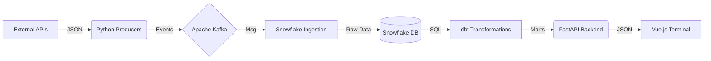

# Black Swan Detection Engine 


## Table of Contents

* [Problem Statement](#problem-statement)
* [The Solution](#the-solution)
* [Tech Stack](#tech-stack)
* [Project Architecture](#project-architecture)
* [Repository Structure](#repository-structure)
* [Component Deep Dive](#component-deep-dive)
    * [1. Data Ingestion (Producers)](#1-data-ingestion-producers)
    * [2. Streaming Layer (Kafka)](#2-streaming-layer-kafka)
    * [3. Data Warehousing (Snowflake)](#3-data-warehousing-snowflake)
    * [4. Transformation (dbt)](#4-transformation-dbt)
    * [5. The Terminal (Frontend)](#5-the-terminal-frontend)
* [Deployment Guide](#deployment-guide)
* [Future Roadmap](#future-roadmap)

---

## Problem Statement

### The Information Gap in Retail Trading

Financial markets are increasingly driven by algorithmic trading, high-frequency bots, and institutional "whales" who have access to sub-millisecond data. Retail traders, on the other hand, often suffer from a severe **information asymmetry**:

1.  **Delayed Data**: Most free charts operate on a 15-minute delay or lack tick-level granularity.
2.  **Fragmented Tooling**: technical analysis (charts), fundamental analysis (news), and sentiment analysis (social media) usually require three separate subscriptions/tabs.
3.  **"Black Swan" Vulnerability**: Rare, catastrophic events (e.g., flash crashes, geopolitical shocks) move markets instantly. By the time a casual trader sees the news on TV, the "smart money" has already moved.

The typical retail trader reacts to price history, whereas the institutional trader reacts to **live signals**. To bridge this gap, we need a system that brings institutional-grade signal detection to a consumer-grade interface.

## The Solution

**The Black Swan Detection Engine** is an end-to-end, real-time market intelligence platform designed to ingest, correlate, and visualize disparate data sources instantly.

It acts as a **centralized nervous system** for market data:
*   **Ingests**: Live tick data (Stock/Crypto) and breaking news headlines (RSS/API) simultaneously.
*   **Processes**: Uses a streaming architecture to normalize and buffer high-velocity data.
*   **Analyses**: Applies transformation models to calculate technical indicators (RSI, Bollinger Bands, MACD) and Sentiment Scores on the fly.
*   **Visualizes**: Presents this data in a unified, **"Retro-Cyberpunk"** dashboard that highlights "Pump" (Bullish) and "Dump" (Bearish) anomalies immediately.

The goal is not just to show *what* is happening, but *why* it is happening, by overlaying news impact directly onto price action.

---

## Tech Stack

We utilize a modern **Data Engineering Stack** focused on high throughput, scalability, and modularity.

*   **Ingestion Agents**: **Python 3.9+**
    *   Custom-built producers that act as autonomous agents for polling APIs (AlphaVantage, Yahoo Finance).
*   **Streaming Backbone**: **Apache Kafka & Zookeeper**
    *   Chosen for its ability to handle "firehose" data streams and decouple ingestion from storage.
    *   Guarantees durability and orderly processing of tick data.
*   **Data Warehouse**: **Snowflake**
    *   Selected for its separation of storage and compute.
    *   Serves as our "Data Lake" (Bronze, Raw JSON) and "Data Mart" (Gold, Curated Tables).
*   **Transformation**: **dbt Core (Data Build Tool)**
    *   Implements the **Medallion Architecture** (Bronze → Silver → Gold).
    *   Handles "ELT" (Extract, Load, Transform) logic using SQL-based models.
*   **Backend API**: **FastAPI**
    *   Asynchronous Python framework that delivers JSON payloads to the frontend with sub-50ms latency.
*   **Frontend**: **Vue.js 3 + Vite**
    *   A high-performance Reactive UI framework.
    *   Uses `vue-chartjs` for rendering complex financial time-series data.
*   **Orchestration**: **Apache Airflow**
    *   Manages batch jobs, backfilling history, and triggering periodic dbt model rebuilds.
*   **Containerization**: **Docker & Docker Compose**
    *   Ensures 100% environment consistency across development and production.

---

## Project Architecture

The pipeline follows a strict **unidirectional data flow**:




1.  **Extract**: Producers poll external sources (Yahoo Finance, Reddit, AlphaVantage).
2.  **Buffer**: Messages are serialized and pushed to Kafka topics (`market_prices`, `market_news`).
3.  **Load**: A Consumer service (or Snowpipe) loads raw events into Snowflake's `BRONZE` schema.
4.  **Transform**: dbt scheduled jobs clean this data into `SILVER` (Staging) and aggregate it into `GOLD` (Fact Tables).
5.  **Serve**: FastAPI queries the `GOLD` tables and serves the data to the Vue Client.

---

## Repository Structure

```text
blackSwan/
├── airflow/                    # ORCHESTRATION LAYER
│   ├── dags/                   #   Python definitions for Airflow DAGs
│   └── plugins/                #   Custom Airflow plugins
├── backend/                    # API LAYER
│   ├── app/
│   │   ├── main.py             #   FastAPI Entrypoint & Routes
│   │   ├── database.py         #   Snowflake Connector Logic
│   │   └── models.py           #   Pydantic Response Schemas
│   ├── Dockerfile              #   Backend Container Config
│   └── requirements.txt        #   Python Dependnecies
├── blackswan_dbt/              # TRANSFORMATION LAYER
│   ├── models/
│   │   ├── marts/              #   Gold: Business Logic (Indicators, Sentiment)
│   │   ├── staging/            #   Silver: Cleaning & Casting
│   │   └── intermediate/       #   Complex Joins
│   ├── dbt_project.yml         #   dbt Configuration
│   └── profiles.yml            #   Connection Profile (Git-ignored secrets)
├── frontend/                   # PRESENTATION LAYER
│   ├── src/
│   │   ├── components/         #   UI Widgets (Charts, Modals, NewsFeed)
│   │   ├── views/              #   Page Layouts (Signals, Dashboard)
│   │   └── assets/             #   Fonts & Images
│   └── vite.config.js          #   Build Configuration
├── producers/                  # INGESTION LAYER
│   ├── stream_prices.py        #   Live Tick Data Producer
│   ├── stream_news.py          #   Global News Producer
│   └── stream_reddit.py        #   Social Sentiment Scraper
├── docker-compose.yml          # INFRASTRUCTURE DEFINITION
└── README.md                   # DOCUMENTATION
```

---

## Component Deep Dive

## Ingestion Layer (Producers)

The ingestion layer is the **"Bronze"** stage of your Medallion Architecture. Its primary responsibility is to capture data from source APIs and land it into Kafka as quickly and reliably as possible, without changing the original content.

### Core Principles

* **Immutability**: We store the raw JSON exactly as it arrives. This allows us to "replay" the data later if our transformation logic changes.
* **Decoupling**: The producers don't care if Snowflake is down or if dbt is running. They only care about handing the data off to Kafka.

---

### 1. `stream_prices.py`: The Market Ticker

This producer handles high-velocity numerical data. It requires low latency to ensure signals are generated on the most recent "ticks."

* **Technical Logic**:
* **WebSocket Integration**: Instead of polling every second (which is inefficient), it uses a persistent WebSocket to receive "pushed" updates from a provider like Yahoo Finance or Alpaca.
* **Schema Enforcement**: Before sending to Kafka, it wraps the raw tick in a standard envelope containing a `producer_timestamp` and a `source_id`.


* **Fault Tolerance**:
* **Acknowlegements (`acks='all'`)**: The producer waits for Kafka to confirm the data is replicated across all brokers before moving to the next tick.
* **Exponential Backoff**: If the API connection drops, the script waits (1s, 2s, 4s...) to reconnect, preventing "hammering" the provider's server.


### 2. `stream_news.py`: The Contextual Feed

This producer handles unstructured text data. Unlike price ticks, news arrives in irregular "bursts."

* **Technical Logic**:
* **RSS/API Polling**: Polls feeds every 5–10 minutes. It extracts the `headline`, `summary`, and the `URL`.
* **URL Hashing**: To avoid sending the same "Breaking News" story multiple times (since RSS feeds often repeat items), it hashes the URL. If the hash has been sent in the last 24 hours, it skips the record.


* **Metadata Enrichment**:
* **Preliminary Scoring**: Uses a lightweight Python library (like `TextBlob` or a simple regex dictionary) to tag the news with an initial sentiment score (e.g., "Positive" for "Merger", "Negative" for "Loss") before it even hits the warehouse.


### 3. `stream_reddit.py`: The Social Pulse

This producer captures the "noise" of the retail market by monitoring specific community discussions.

* **Technical Logic**:
* **PRAW Wrapper**: Uses the Python Reddit API Wrapper to "stream" new comments from subreddits like `r/wallstreetbets`.
* **Keyword Filtering**: Only comments mentioning your "Watchlist" tickers (e.g., $TSLA, $NVDA) are sent to Kafka to keep the data volume manageable.


---
The **Streaming Layer** is the high-speed bridge of your architecture. It takes the data from your local Python producers and delivers it to Snowflake with sub-second latency.

While the producers handle the "pushing," the streaming layer handles the **buffering, persistence, and delivery guarantees**.

---

## The Streaming Layer (Kafka & Snowpipe)

### 1. The Central Backbone: Apache Kafka

Kafka acts as a **buffer** between your fast-moving producers and Snowflake. This "decouples" the systems—if your producers spike in activity or if Snowflake goes into a maintenance window, Kafka holds the data safely in a queue.

* **Topics**: We use specific topics for different data streams (e.g., `stock_prices`, `market_news`, `reddit_sentiment`).
* **Partitions**: These allow us to parallelize data. For a "Black Swan" engine, having multiple partitions for `stock_prices` ensures we can handle high-volume symbols like TSLA or NVDA without bottlenecking.
* **Retention**: We typically keep 24–48 hours of raw data in Kafka. This is our safety net—if a dbt model fails, we can "replay" the streaming data from the last 24 hours to fix it.


(S3-CONSUMER SENDS THE DATA TO S3)


### 2. The Bridge: Snowflake Kafka Connector

Instead of writing custom Python code to "upload" to Snowflake, we use the **Official Snowflake Kafka Sink Connector**. It runs inside your Docker environment (Kafka Connect) and continuously monitors your topics.

* **Snowpipe Streaming API**: Your project uses the modern **Streaming SDK** rather than traditional bulk loading. This writes rows directly to Snowflake tables without creating temporary files, reducing latency from minutes to **sub-5 seconds**.
* **Exactly-Once Delivery**: The connector tracks "Offset Tokens." If the Docker container restarts, it asks Snowflake, *"What was the last message you received?"* and resumes exactly from that point, ensuring no data is lost or duplicated.


### 3. The Landing Zone: Snowflake "Bronze" Tables

The streaming layer delivers data into what we call **Transient Tables** in Snowflake.

* **VARIANT Columns**: We don't worry about the schema here. The connector dumps the entire JSON payload into a single column of type `VARIANT`. This prevents the pipeline from breaking if an API adds a new field.
* **Metadata Enrichment**: The connector automatically adds columns like `RECORD_METADATA` (containing the Kafka offset and partition) and `INSERTED_AT`, which are critical for the deduplication logic we'll use in the next step (dbt).


---

The images you provided show the **Transformation** and **Storage** layers of your project in action, specifically how dbt models materialize as structured tables within Snowflake's data warehouse environment.

---

## The dbt Transformation Layer

This image highlights the development of your **Gold/Marts** layer using the dbt Power User extension in VS Code.

* **Logic Development**: You are defining the `mart_algo_signals.sql` model, which pulls data from an intermediate technical indicators model.
* **Window Functions**: The `crossover_setup` CTE uses the `LAG()` function to compare current market data (like MACD or RSI) against previous values. This is the "brain" of the engine that identifies specific market crossovers.
* **Query Results**: The bottom panel shows the successful output of your transformation. It produces a clear table of trading signals (`HOLD`, `SELL_OVERBOUGHT`, etc.) mapped to specific timestamps and prices, ready to be served by your FastAPI backend.
* **Clustering**: The `config` block at the top shows `cluster_by=['strategy_name', 'symbol', 'event_time']`, which tells Snowflake how to physically organize the data for maximum query speed.


(Social Sentiment from news)

(Stock prices)

(Reddit Comments)
---

## The Snowflake Storage Layer

This image shows your **Medallion Architecture** fully implemented inside the Snowflake UI.

* **Raw Layer (Bronze)**: The SQL script in the worksheet defines your landing tables (`RAW_STOCK_PRICES`, `RAW_MARKET_NEWS`). These tables use the `VARIANT` data type to store the raw JSON payloads from your Kafka producers.
* **Staging Layer (Silver)**: Highlighted in the sidebar, these tables (`STG_MARKET_NEWS`, etc.) contain cleaned and casted data. You can see the schema results showing standard columns like `EVENT_ID`, `SYMBOL`, and `CLOSE_PRICE` as proper `VARCHAR` and `FLOAT` types.
* **Marts Layer (Gold)**: The top red box shows your business-ready tables. This includes `MART_ALGO_SIGNALS` and `MART_NEWS_Impact`, which are the final curated datasets your Vue.js dashboard will visualize.
* **Role & Warehouse**: The top-right shows you are operating as `ACCOUNTADMIN` using a `COMPUTE_WH (X-Small)` warehouse, which is efficient for managing these dbt transformations.

---
## Orchestration Layer (Apache Airflow)

Apache Airflow is the **"Central Nervous System"** of your Black Swan Sentiment Engine. It provides a programmatic framework to author, schedule, and monitor your entire data workflow as Python code.

### The Architecture of a DAG

In Airflow, you define your pipeline as a **Directed Acyclic Graph (DAG)**. This ensures that your tasks—from starting producers to triggering dbt models—follow a strictly defined order without circular loops.

* **Scheduler (The Brain)**: Continuously monitors your DAG directory and decides which tasks need to run based on their schedule (e.g., every minute) or dependency status.
* **Workers & Executors (The Muscles)**: Responsible for the actual execution of tasks. In your Docker setup, these workers carry out the `dbt run` or `python stream_prices.py` commands.
* **Webserver (The Dashboard)**: Provides a rich UI to visualize task status, view logs, and manually re-trigger failed runs.


### Orchestrating dbt with Airflow

Since dbt does not have a built-in scheduler, Airflow fills this gap by triggering your transformations once the ingestion layer has finished landing data in Snowflake.

* **Task Dependencies**: You can chain tasks together so that `run_marts` only begins if `run_staging` completes successfully.
* **Granular Control**: Using frameworks like **Astronomer Cosmos**, your dbt project is parsed into individual Airflow tasks. This allows you to see exactly which model failed (e.g., `mart_algo_signals`) and retry only that specific part of the graph.
* **Data Quality Checks**: Airflow can be configured to run `dbt test` after every run, preventing broken or incomplete data from reaching your final Gold layer.


### Resilience and Alerting

One of Airflow's greatest strengths in a production-grade pipeline is its ability to handle "real-world" errors.

* **Retry Logic**: If a Snowflake connection blips during a transformation, Airflow automatically retries the task after a set delay (e.g., 5 minutes).
* **Monitoring**: Through the UI, you gain full visibility into the execution time of each task, helping you identify performance bottlenecks in your SQL models.

**Would you like me to help you draft the `dags/blackswan_main.py` file to start automating your ingestion and dbt models?**


---

## The Web App (The BlackSwan Terminal)

The frontend is designed to be more than just a dashboard—it's an immersive **Market Intelligence Terminal**. Built with **Vue.js 3** and **Vite**, it features a unique "Retro-Cyberpunk" aesthetic ("The BlackSwan Times") that creates a high-urgency trading environment.


### 1. The Dashboard (Command Center)
The landing page provides a high-level "Health Check" of the entire market.
*   **Sector Performance**: A color-coded bar chart (Green/Red) visualizing which sectors (Tech, Energy, Finance) are leading or lagging.
*   **Market Sentiment Gauge**: A speedometer-style widget aggregated from thousands of Reddit comments and News headlines, showing if the market is in "Extreme Fear" or "Greed."
*   **Live Metrics**: Ticker tape displaying real-time prices for major indices (SPY, QQQ, BTC).


### 2. The Signals Feed (Algorithmic Scanner)
This is the "Money Maker" tab. It filters the noise and presents high-probability trade setups generated by our dbt models.
*   **Real-Time Alerts**: A scrolling feed of "Golden Crosses," "RSI Oversold," and "MACD Bullish Divergence" signals.
*   **Split-Pane Design**: Clicking any signal opens a "Deep Dive" panel on the right.
*   **Interactive Modal**: A massive, full-screen chart modal (using `AdvancedChartModal.vue`) allows you to inspect price action with simulated "Buy/Sell Zones" and dynamic technical indicators overlayed on the graph.


### 3. The Newsroom (The BlackSwan Times)
A "Newspaper" for the digital age. This tab aggregates global financial news into a structured, easy-to-read layout.
*   **Impact Scoring**: Headlines are not just listed chronologically; they are sorted by **Impact Score**. A merger announcement will take the "Hero" spot, while minor earnings reports are relegated to the sidebar.
*   **Rubber Hose Aesthetic**: Styled like a 1930s broadsheet, complete with "Old English" fonts and high-contrast borders, but powered by live WebSocket data.
*   **Sentiment Tagging**: Each article is auto-tagged as "Bullish" (Green) or "Bearish" (Red) by our NLP processing layer.


---

## Deployment Guide

Follow these steps to spin up the entire "Black Swan" ecosystem on your local machine.

### Prerequisites
*   **Docker Desktop** (Allocated at least 4GB RAM).
*   **Python 3.9+** & **Node.js 16+**.
*   **Snowflake Account** (Trial is sufficient).
*   **API Keys** (Optional but recommended): AlphaVantage, NewsAPI.

### Step 1: Environment Configuration
Create a `.env` file in the project root:

```bash
# SNOWFLAKE CREDENTIALS
SNOWFLAKE_USER=my_user
SNOWFLAKE_PASSWORD=my_password
SNOWFLAKE_ACCOUNT=xy12345.us-east-1
SNOWFLAKE_DATABASE=BLACKSWAN_DB
SNOWFLAKE_SCHEMA=BRONZE

# KAFKA CONFIG
BOOTSTRAP_SERVERS=broker:29092
```

### Step 2: Infrastructure Launch
Start the containers. This will pull images for Kafka, Zookeeper, Airflow, and the Python backend.

```bash
docker-compose up -d --build
```
*Note: The first run may take 5-10 minutes to download all images.*

### Step 3: Database Migration
Initialize the dbt project and seed the database.

```bash
cd blackswan_dbt
dbt deps
dbt seed
dbt run
```

### Step 4: Ignite the Data Stream
In separate terminal windows, start your producers:

```bash
# Terminal A: Start Price Feed
python -m producers.stream_prices

# Terminal B: Start News Feed
python -m producers.stream_news
```
*You should see logs indicating "Message sent to Kafka topic market_prices..."*

### Step 5: Launch the Terminal
Start the Vue.js frontend server.

```bash
cd frontend
npm install
npm run dev
```


---

## Future Roadmap 

*   **v2.0 - Machine Learning**: Implementation of an LSTM (Long Short-Term Memory) model to predict price direction 10 minutes into the future based on order book depth.
*   **v2.1 - Social Sentiment V2**: Direct integration with the Twitter API (X) to track "Cashtags" ($AAPL, $BTC) in real-time.
*   **v3.0 - Automated Trading**: Adding a "Paper Trading" module to execute simulated trades based on the engine's signals.
