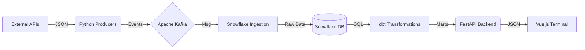

# Black Swan Detection Engine 


## Table of Contents

* [Problem Statement](#problem-statement)
* [The Solution](#the-solution)
* [Tech Stack](#tech-stack)
* [Project Architecture](#project-architecture)
* [Repository Structure](#repository-structure)
* [Component Deep Dive](#component-deep-dive)
    * [1. Data Ingestion (Producers)](#1-data-ingestion-producers)
    * [2. Streaming Layer (Kafka)](#2-streaming-layer-kafka)
    * [3. Data Warehousing (Snowflake)](#3-data-warehousing-snowflake)
    * [4. Transformation (dbt)](#4-transformation-dbt)
    * [5. The Terminal (Frontend)](#5-the-terminal-frontend)
* [Deployment Guide](#deployment-guide)
* [Future Roadmap](#future-roadmap)

---

## Problem Statement

### The Information Gap in Retail Trading

Financial markets are increasingly driven by algorithmic trading, high-frequency bots, and institutional "whales" who have access to sub-millisecond data. Retail traders, on the other hand, often suffer from a severe **information asymmetry**:

1.  **Delayed Data**: Most free charts operate on a 15-minute delay or lack tick-level granularity.
2.  **Fragmented Tooling**: technical analysis (charts), fundamental analysis (news), and sentiment analysis (social media) usually require three separate subscriptions/tabs.
3.  **"Black Swan" Vulnerability**: Rare, catastrophic events (e.g., flash crashes, geopolitical shocks) move markets instantly. By the time a casual trader sees the news on TV, the "smart money" has already moved.

The typical retail trader reacts to price history, whereas the institutional trader reacts to **live signals**. To bridge this gap, we need a system that brings institutional-grade signal detection to a consumer-grade interface.

## The Solution

**The Black Swan Detection Engine** is an end-to-end, real-time market intelligence platform designed to ingest, correlate, and visualize disparate data sources instantly.

It acts as a **centralized nervous system** for market data:
*   **Ingests**: Live tick data (Stock/Crypto) and breaking news headlines (RSS/API) simultaneously.
*   **Processes**: Uses a streaming architecture to normalize and buffer high-velocity data.
*   **Analyses**: Applies transformation models to calculate technical indicators (RSI, Bollinger Bands, MACD) and Sentiment Scores on the fly.
*   **Visualizes**: Presents this data in a unified, **"Retro-Cyberpunk"** dashboard that highlights "Pump" (Bullish) and "Dump" (Bearish) anomalies immediately.

The goal is not just to show *what* is happening, but *why* it is happening, by overlaying news impact directly onto price action.

---

## Tech Stack

We utilize a modern **Data Engineering Stack** focused on high throughput, scalability, and modularity.

*   **Ingestion Agents**: **Python 3.9+**
    *   Custom-built producers that act as autonomous agents for polling APIs (AlphaVantage, Yahoo Finance).
*   **Streaming Backbone**: **Apache Kafka & Zookeeper**
    *   Chosen for its ability to handle "firehose" data streams and decouple ingestion from storage.
    *   Guarantees durability and orderly processing of tick data.
*   **Data Warehouse**: **Snowflake**
    *   Selected for its separation of storage and compute.
    *   Serves as our "Data Lake" (Bronze, Raw JSON) and "Data Mart" (Gold, Curated Tables).
*   **Transformation**: **dbt Core (Data Build Tool)**
    *   Implements the **Medallion Architecture** (Bronze → Silver → Gold).
    *   Handles "ELT" (Extract, Load, Transform) logic using SQL-based models.
*   **Backend API**: **FastAPI**
    *   Asynchronous Python framework that delivers JSON payloads to the frontend with sub-50ms latency.
*   **Frontend**: **Vue.js 3 + Vite**
    *   A high-performance Reactive UI framework.
    *   Uses `vue-chartjs` for rendering complex financial time-series data.
*   **Orchestration**: **Apache Airflow**
    *   Manages batch jobs, backfilling history, and triggering periodic dbt model rebuilds.
*   **Containerization**: **Docker & Docker Compose**
    *   Ensures 100% environment consistency across development and production.

---

## Project Architecture

The pipeline follows a strict **unidirectional data flow**:




1.  **Extract**: Producers poll external sources (Yahoo Finance, Reddit, AlphaVantage).
2.  **Buffer**: Messages are serialized and pushed to Kafka topics (`market_prices`, `market_news`).
3.  **Load**: A Consumer service (or Snowpipe) loads raw events into Snowflake's `BRONZE` schema.
4.  **Transform**: dbt scheduled jobs clean this data into `SILVER` (Staging) and aggregate it into `GOLD` (Fact Tables).
5.  **Serve**: FastAPI queries the `GOLD` tables and serves the data to the Vue Client.

---

## Repository Structure

```text
blackSwan/
├── airflow/                    # ORCHESTRATION LAYER
│   ├── dags/                   #   Python definitions for Airflow DAGs
│   └── plugins/                #   Custom Airflow plugins
├── backend/                    # API LAYER
│   ├── app/
│   │   ├── main.py             #   FastAPI Entrypoint & Routes
│   │   ├── database.py         #   Snowflake Connector Logic
│   │   └── models.py           #   Pydantic Response Schemas
│   ├── Dockerfile              #   Backend Container Config
│   └── requirements.txt        #   Python Dependnecies
├── blackswan_dbt/              # TRANSFORMATION LAYER
│   ├── models/
│   │   ├── marts/              #   Gold: Business Logic (Indicators, Sentiment)
│   │   ├── staging/            #   Silver: Cleaning & Casting
│   │   └── intermediate/       #   Complex Joins
│   ├── dbt_project.yml         #   dbt Configuration
│   └── profiles.yml            #   Connection Profile (Git-ignored secrets)
├── frontend/                   # PRESENTATION LAYER
│   ├── src/
│   │   ├── components/         #   UI Widgets (Charts, Modals, NewsFeed)
│   │   ├── views/              #   Page Layouts (Signals, Dashboard)
│   │   └── assets/             #   Fonts & Images
│   └── vite.config.js          #   Build Configuration
├── producers/                  # INGESTION LAYER
│   ├── stream_prices.py        #   Live Tick Data Producer
│   ├── stream_news.py          #   Global News Producer
│   └── stream_reddit.py        #   Social Sentiment Scraper
├── docker-compose.yml          # INFRASTRUCTURE DEFINITION
└── README.md                   # DOCUMENTATION
```

---

## Component Deep Dive

### 1. Data Ingestion (Producers)
The `producers/` directory contains independent Python scripts designed for fault tolerance.
*   **`stream_prices.py`**: Connects to the **Yahoo Finance WebSocket** (or polling API) to fetch real-time OHLCV (Open, High, Low, Close, Volume) data for a watchlist of assets (e.g., AAPL, NVDA, BTC-USD). It normalizes the data into a standard JSON schema before emitting to Kafka.
*   **`stream_news.py`**: Polls RSS feeds and News APIs for breaking headlines. It assigns a preliminary "Impact Score" based on keyword matching (e.g., "Bankruptcy" = High Negative, "Merger" = High Positive).

### 2. Streaming Layer (Kafka)
We use a single-node Kafka cluster (via Docker) with Zookeeper coordination.
*   **Topics**:
    *   `market_prices`: 3 partitions, key=Symbol. Ensures all updates for "AAPL" go to the same partition, preserving order.
    *   `market_news`: 1 partition. Lower volume, global ordering is preferred.
*   **Why Kafka?**: In a crash, data volume spikes 100x. Kafka acts as a shock absorber, preventing the database from locking up under write pressure.

### 3. Data Warehousing (Snowflake)
We leverage Snowflake's architecture for its near-zero maintenance and auto-scaling.
*   **Bronze Schema**: Stores raw JSON variants. We use the `VARIANT` column type to ingest semi-structured data without defining a rigid schema upfront (Schema-on-Read).
*   **Silver Schema**: Flattens the JSON into columnar tables (`PRICE`, `TIMESTAMP`, `SYMBOL`). Handles de-duplication of retry messages.

### 4. Transformation (dbt)
The "Brain" of the operation. dbt allows us to write modular SQL models that build upon each other.
*   **`stg_stock_prices`**: Cleans raw data, casts timestamps to UTC.
*   **`int_technical_indicators`**: Uses SQL Window Functions to calculate:
    *   **RSI (Relative Strength Index)**: Detects Overbought (>70) or Oversold (<30) conditions.
    *   **SMA (Simple Moving Average)**: Calculates 50-day and 200-day averages to identify Golden Crosses.
*   **`mart_signals`**: The final output table. It joins Sentiment + Technicals to generate "Buy", "Sell", or "Hold" signals.

### 5. The Terminal (Frontend)
The user interface is a purposeful departure from the sterile, white-background finance apps of today.
*   **Aesthetic philosophy**: **"The BlackSwan Times"**. High-contrast, monochromatic Newspaper style mixed with neon indicators. It evokes the urgency of a 1929 trading floor.
*   **Tech**:
    *   **Components**: `Signals.vue` (Split-pane dashboard), `AdvancedChartModal.vue` (Deep dive analysis).
    *   **Interactivity**: Clicking any signal opens a detailed modal with correlating news and price action.
    *   **Responsiveness**: Fully responsive grid layout using CSS Grid and Flexbox.

---

## Deployment Guide

Follow these steps to spin up the entire "Black Swan" ecosystem on your local machine.

### Prerequisites
*   **Docker Desktop** (Allocated at least 4GB RAM).
*   **Python 3.9+** & **Node.js 16+**.
*   **Snowflake Account** (Trial is sufficient).
*   **API Keys** (Optional but recommended): AlphaVantage, NewsAPI.

### Step 1: Environment Configuration
Create a `.env` file in the project root:

```bash
# SNOWFLAKE CREDENTIALS
SNOWFLAKE_USER=my_user
SNOWFLAKE_PASSWORD=my_password
SNOWFLAKE_ACCOUNT=xy12345.us-east-1
SNOWFLAKE_DATABASE=BLACKSWAN_DB
SNOWFLAKE_SCHEMA=BRONZE

# KAFKA CONFIG
BOOTSTRAP_SERVERS=broker:29092
```

### Step 2: Infrastructure Launch
Start the containers. This will pull images for Kafka, Zookeeper, Airflow, and the Python backend.

```bash
docker-compose up -d --build
```
*Note: The first run may take 5-10 minutes to download all images.*

### Step 3: Database Migration
Initialize the dbt project and seed the database.

```bash
cd blackswan_dbt
dbt deps
dbt seed
dbt run
```

### Step 4: Ignite the Data Stream
In separate terminal windows, start your producers:

```bash
# Terminal A: Start Price Feed
python -m producers.stream_prices

# Terminal B: Start News Feed
python -m producers.stream_news
```
*You should see logs indicating "Message sent to Kafka topic market_prices..."*

### Step 5: Launch the Terminal
Start the Vue.js frontend server.

```bash
cd frontend
npm install
npm run dev
```
Visit **http://localhost:5173**. You are now live. 🟢

---

## Future Roadmap �

*   **v2.0 - Machine Learning**: Implementation of an LSTM (Long Short-Term Memory) model to predict price direction 10 minutes into the future based on order book depth.
*   **v2.1 - Social Sentiment V2**: Direct integration with the Twitter API (X) to track "Cashtags" ($AAPL, $BTC) in real-time.
*   **v3.0 - Automated Trading**: Adding a "Paper Trading" module to execute simulated trades based on the engine's signals.
